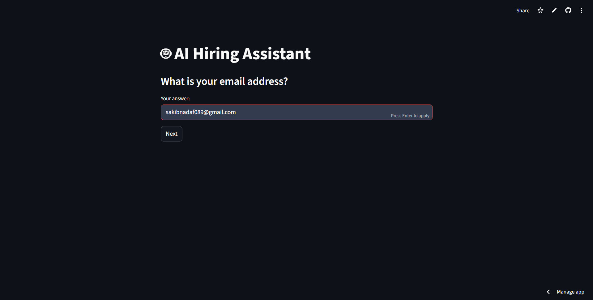
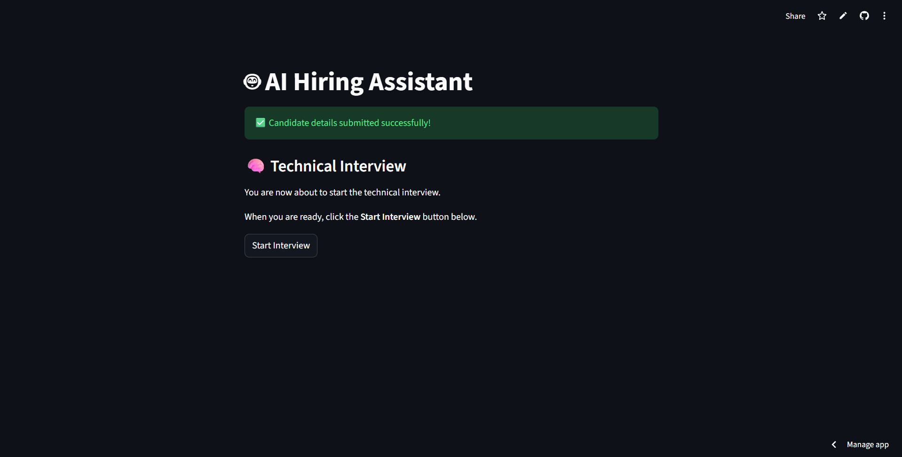
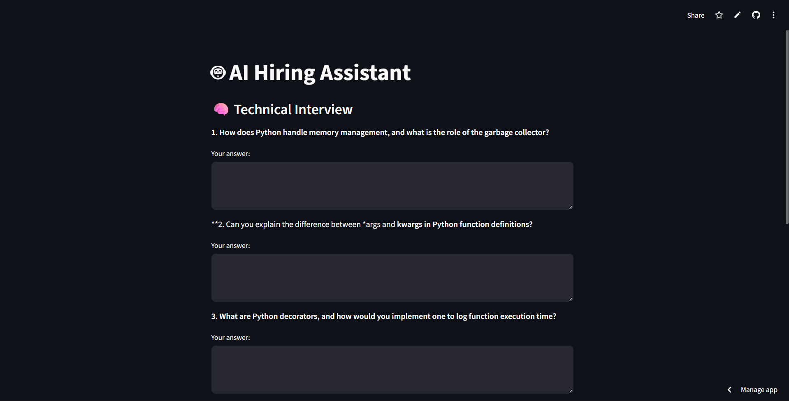
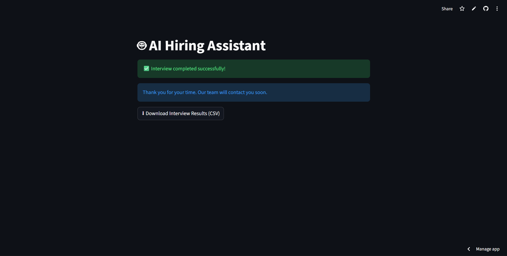

# AI Hiring Assistant

🌐 **Live Demo:** https://ai-hiring-assistant-2r6ndzg6nr2toikrncx3tc.streamlit.app/


This project is an AI-powered hiring assistant built using Streamlit and Cohere.

## Features
- Step-by-step candidate information collection
- Tech stack–based technical interview questions
- Dedicated answer input for each question
- Controlled interview start flow
- CSV storage of interview results
- Downloadable interview report

## Tech Stack
- Python
- Streamlit
- Cohere LLM
- CSV-based storage

## How It Works
1. Candidate enters personal details
2. Interview readiness screen is shown
3. Technical questions are generated dynamically
4. Candidate submits answers
5. Interview data is stored in CSV

## Data Storage
Interview data is stored in a CSV file with timestamps for easy review.  
This can be extended to databases in production.

## Run Locally
```bash
streamlit run app.py
```
## 📸 Application Screenshots

### 🏠 Home Screen


### 🧑 Candidate Details Collection


### ▶️ Interview Start Screen


### 🧠 Technical Interview Questions


### ✅ Interview Completion


